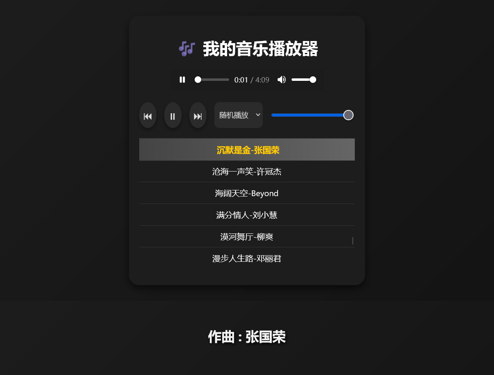

# lihan_web_music_player 🎶

  



一款基于 **Golang + Gin** 的简洁在线音乐播放器，支持本地音乐播放和歌词显示，带有现代化 UI 和浮动歌词字幕。

## 功能 Features

- 🎵 播放本地音乐文件（mp3/m4a/mp4 等）
- 📝 自动加载同名 `.lrc` 歌词，支持底部浮动字幕显示
- 🔁 支持播放模式切换：顺序播放 / 单曲循环 / 随机播放
- 🔊 音量调节
- 🎨 简洁美观的深色 UI，歌单滚动条美化
- ✨ 当前播放高亮、鼠标悬停和点击反馈效果

## 安装 Installation

1. 克隆仓库
```bash
git clone https://github.com/lihan3238/lihan_web_music_player.git
cd lihan_web_music_player
```

2. 安装依赖

```bash
go mod tidy
```

3. 准备音乐文件

* 将音乐文件放到 `music/` 文件夹
* 对应歌词文件命名格式为 `歌曲名.lrc`，放在同目录

4. 运行服务

```bash
go run main.go
```

5. 打开浏览器访问

```
http://localhost:8080
```

## 使用 Usage

* 点击歌单播放音乐
* 控制按钮：上一首 / 播放/暂停 / 下一首
* 播放模式选择：下拉框选择顺序播放、单曲循环或随机播放
* 调整音量滑块

## 项目结构 Project Structure

```

lihan_web_music_player/
├─ main.go           # 后端主程序
├─ templates/
│  └─ index.html     # 前端页面
├─ static/
│  ├─ style.css      # 样式文件
│  └─ cover.png      # 封面截图
├─ music/            # 本地音乐文件夹（.gitignore 忽略）
└─ README.md
```

## 贡献 Contributing

欢迎提交 Issue 或 PR，帮助改进播放器功能或美化界面。

## License

MIT License


