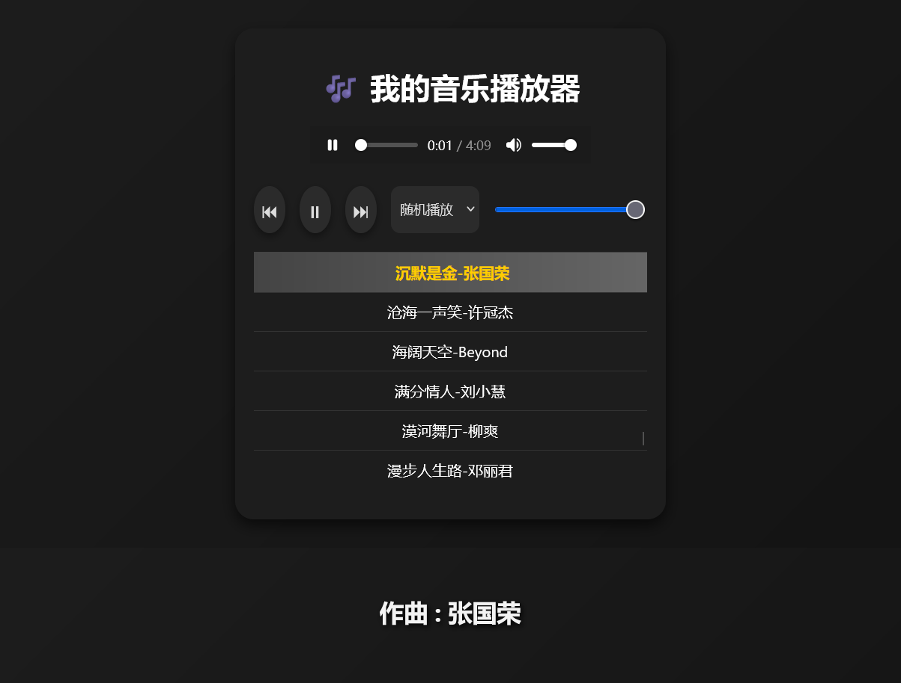

# lihan_web_music_player 🎶




一款基于 **Golang + Gin** 的简洁在线音乐播放器，支持本地音乐播放与歌词显示，具备现代化 UI 和浮动歌词字幕效果。

---

## ✨ 功能 Features

- 🎵 播放本地音乐文件（`mp3 / m4a / mp4 / ogg / wav / flac`）
- 📝 自动加载同名歌词文件（`.lrc / .txt`），支持浮动字幕
- 🔁 播放模式切换：顺序播放 / 单曲循环 / 随机播放
- 🔊 音量调节
- 🎨 深色简洁 UI，歌单滚动条与交互效果优化
- ✨ 当前播放高亮、鼠标悬停与点击反馈
- 📂 **支持多个音乐目录（`music/ + musics/` 并集）**
- 🚀 **支持自定义启动端口（环境变量 / 启动参数）**

---

## 📦 安装 Installation

### 1️⃣ 克隆仓库

```bash
git clone https://github.com/lihan3238/lihan_web_music_player.git
cd lihan_web_music_player
````

---

### 2️⃣ 安装依赖

```bash
go mod tidy
```

---

### 3️⃣ 准备音乐文件

支持 **多个音乐目录并集**：

* `music/`
* `musics/`

任意一个或两个同时存在均可，程序会自动合并扫描。

#### 方式一：直接放文件（推荐）

```text
music/
├─ song1.mp3
├─ song1.lrc
├─ song2.mp3
```

```text
musics/
├─ song3.mp3
├─ song3.lrc
```

#### 方式二：Windows 使用符号链接（可选）

```bat
mklink /D musics D:\Your\Music\Folder
```

> ⚠️ 注意
>
> * `music/`、`musics/` 均应加入 `.gitignore`
> * 仅作为 **本地资源目录**，不参与版本控制

---

## ▶️ 运行 Run

### 默认启动（端口 8080）

```bash
go run main.go
```

访问：

```
http://localhost:8080
```

---

### 自定义端口（三种方式）

#### ✅ 方式一：命令行参数（优先级最高）

```bash
go run main.go -port 9000
```

#### ✅ 方式二：环境变量

```bash
# PowerShell
$env:PORT=9000
go run main.go
```

```bash
# macOS / Linux
PORT=9000 go run main.go
```

#### ✅ 优先级规则

```
启动参数 (-port) > 环境变量 (PORT) > 默认值 (8080)
```

---

## 🎧 使用 Usage

* 点击歌单中的歌曲开始播放
* 控制按钮：上一首 / 播放 / 暂停 / 下一首
* 播放模式选择：顺序 / 单曲循环 / 随机
* 使用音量滑块调整音量
* 歌词自动匹配并显示（若存在）

---

## 📁 项目结构 Project Structure

```text
lihan_web_music_player/
├─ main.go            # 后端主程序（Gin）
├─ templates/
│  └─ index.html      # 前端页面
├─ static/
│  ├─ style.css       # 样式文件
│  └─ cover.png       # 项目封面截图
├─ music/             # 本地音乐目录（.gitignore）
├─ musics/            # 本地音乐目录 / 符号链接（.gitignore）
└─ README.md
```

---

## 🛠️ 技术说明 Notes

* 后端使用 `http.ServeFile`，天然支持 **Range 请求（断点续传）**
* 音频文件存在性判断使用 `os.Stat`，避免大文件读入内存
* 歌词文件自动尝试多目录 + 多扩展名
* 目录扫描结果做去重处理（按歌曲名）

---

## 🤝 贡献 Contributing

欢迎提交 Issue 或 Pull Request，用于：

* 新功能（歌单 / 搜索 / 分类）
* UI / UX 优化
* 性能或结构改进

---

## 📄 License

MIT License